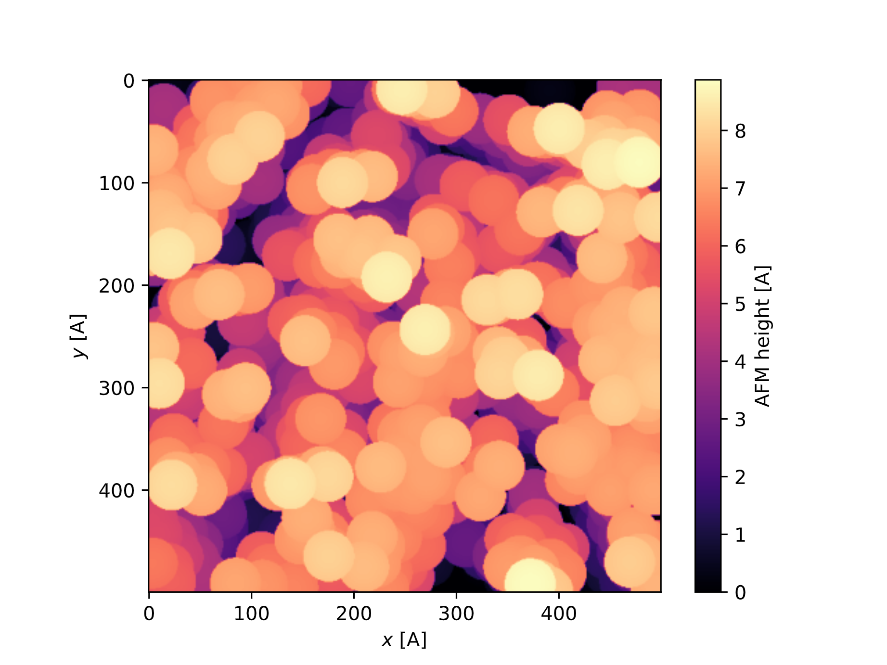

## Idea 
This code performs AFM on MDAnalysis atom groups.
Basically it moves down a tip of diameter `sigma_tip` until it touches the atoms of `atom_sigma` diameter.
This produces a grid of `z-distances` that the AFM needle sees.

